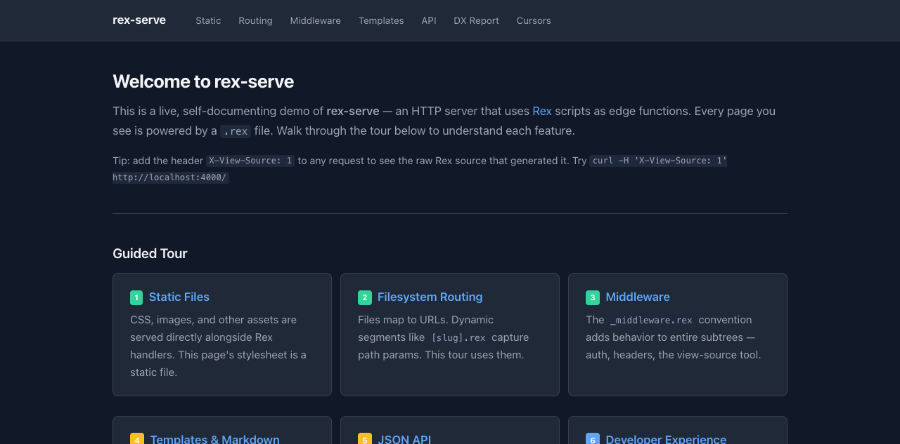
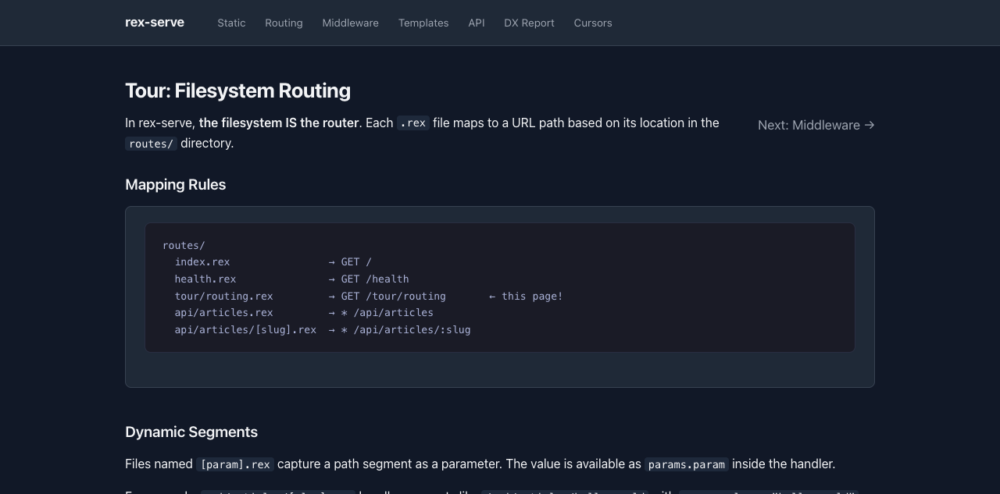
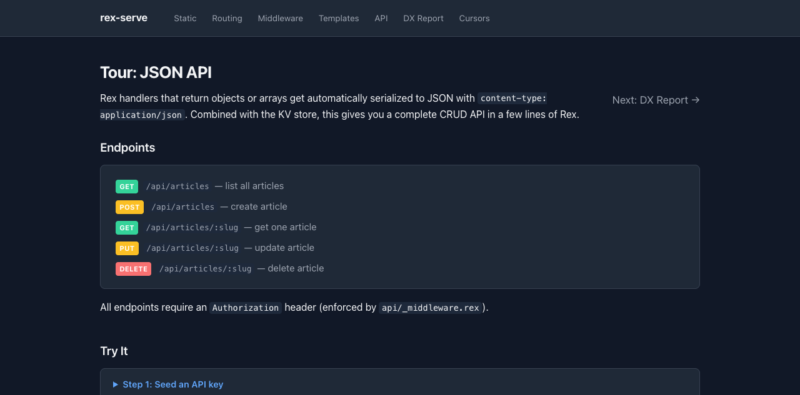
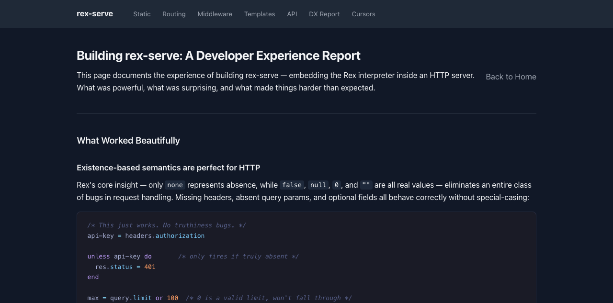

# Knowledge Base — rex-serve Example

A self-documenting demo application for [rex-serve](../../crates/rex-serve/), the Rex edge function server. It implements a small knowledge base with a CRUD API, markdown content pipeline, and a guided tour that explains every feature from the inside.

The app is designed to be read while running — every page shows the Rex source code that generated it.



## Quick Start

From the `rusty-rex` directory:

```sh
cargo run --bin rex-serve -- -d examples/knowledge-base
```

Then open [http://localhost:3000](http://localhost:3000).

## What's Inside

```
knowledge-base/
  rex-serve.toml               # Server config (port, db path, gas limit)
  rex-serve.rexd               # Domain type interface (IDE completions)
  data.db                      # SQLite KV store (auto-created, gitignored)
  routes/
    _middleware.rex             # Global: security headers, view-source tool
    _layouts/page.html          # Mustache template shared by all pages
    _content/sample-article.md  # Markdown content read by handlers
    _ws/cursors.rex             # WebSocket transform for live cursors
    style.css                   # Static CSS (dark/light mode)
    index.rex                   # Homepage with guided tour links
    health.rex                  # JSON health check endpoint
    tour/
      static-files.rex          # Tour 1: static asset serving
      routing.rex               # Tour 2: filesystem routing & dynamic params
      middleware.rex             # Tour 3: middleware chain & short-circuit
      templates.rex             # Tour 4: markdown + mustache pipeline
      api.rex                   # Tour 5: CRUD API with KV store
      experience.rex            # Tour 6: DX report — what worked & what hurt
      cursors.rex               # Live cursors: real-time WebSocket demo
    api/
      _middleware.rex            # Auth: API key validation via KV lookup
      articles.rex              # GET list / POST create
      articles/[slug].rex       # GET / PUT / DELETE single article
```

## Guided Tour

The homepage links to six tour stops, each a Rex handler that explains a rex-serve feature while demonstrating it:

| # | Page | Demonstrates |
|---|------|-------------|
| 1 | [Static Files](/tour/static-files) | Asset serving, resolution priority, tagged template literals |
| 2 | [Routing](/tour/routing) | Filesystem-to-URL mapping, `[param]` dynamic segments |
| 3 | [Middleware](/tour/middleware) | `_middleware.rex` chain, short-circuit auth, view-source tool |
| 4 | [Templates](/tour/templates) | `fs.read` + `markdown.render` + `template.render` pipeline |
| 5 | [API](/tour/api) | JSON CRUD endpoints, KV database, auth middleware |
| 6 | [DX Report](/tour/experience) | Reflections on embedding Rex — strengths and pain points |
| - | [Live Cursors](/tour/cursors) | Real-time WebSocket pub/sub with Rex transform scripts |



## Features Demonstrated

- **Filesystem routing** — files map to URLs, `[slug].rex` captures path params
- **Middleware chain** — `_middleware.rex` runs before handlers in its directory tree
- **Static files** — non-`.rex` files served with automatic content-type detection
- **Private directories** — `_` prefix hides files from HTTP but allows `fs.read()`
- **KV database** — `db.get/set/delete/list` backed by SQLite
- **Markdown rendering** — `markdown.render()` via pulldown-cmark
- **Mustache templates** — `template.render()` with `{{escaped}}` and `{{{raw}}}` slots
- **Tagged templates** — `html\`...\`` auto-escapes interpolated values (XSS prevention)
- **WebSocket pub/sub** — `_ws/cursors.rex` transforms messages before broadcast
- **View-source tool** — add `X-View-Source: 1` header to any request to see its Rex source
- **Hot reload** — edit any `.rex` file and the browser reloads automatically

## API Endpoints



All API routes require an `Authorization` header with a valid key from the KV store.

```sh
# Seed an API key
sqlite3 data.db "INSERT INTO kv VALUES('keys:demo','1')"

# Create an article
curl -X POST http://localhost:3000/api/articles \
  -H 'Authorization: demo' \
  -d '{"slug":"hello","title":"Hello World","body":"# Hello\nCreated via API."}'

# List articles
curl http://localhost:3000/api/articles -H 'Authorization: demo'

# Get one article
curl http://localhost:3000/api/articles/hello -H 'Authorization: demo'

# Update
curl -X PUT http://localhost:3000/api/articles/hello \
  -H 'Authorization: demo' \
  -d '{"title":"Updated Title"}'

# Delete
curl -X DELETE http://localhost:3000/api/articles/hello -H 'Authorization: demo'
```

## Configuration

`rex-serve.toml` controls server settings:

```toml
[server]
host = "0.0.0.0"
port = 3000
gas_limit = 1_000_000    # Max bytecode ops per request

[routes]
dir = "routes"

[db]
path = "data.db"          # SQLite file, auto-created
```

## Developer Experience



The [DX Report](/tour/experience) tour stop documents the experience of embedding Rex as an edge function runtime — what language features mapped well to HTTP, and where the toolchain needed work.

## Domain Type Interface

`rex-serve.rexd` declares the full server API — request/response objects, opcodes, and types. IDEs with Rex language support use this file for completions, hover docs, and type checking. Handlers don't import it; the server injects these bindings at runtime.
