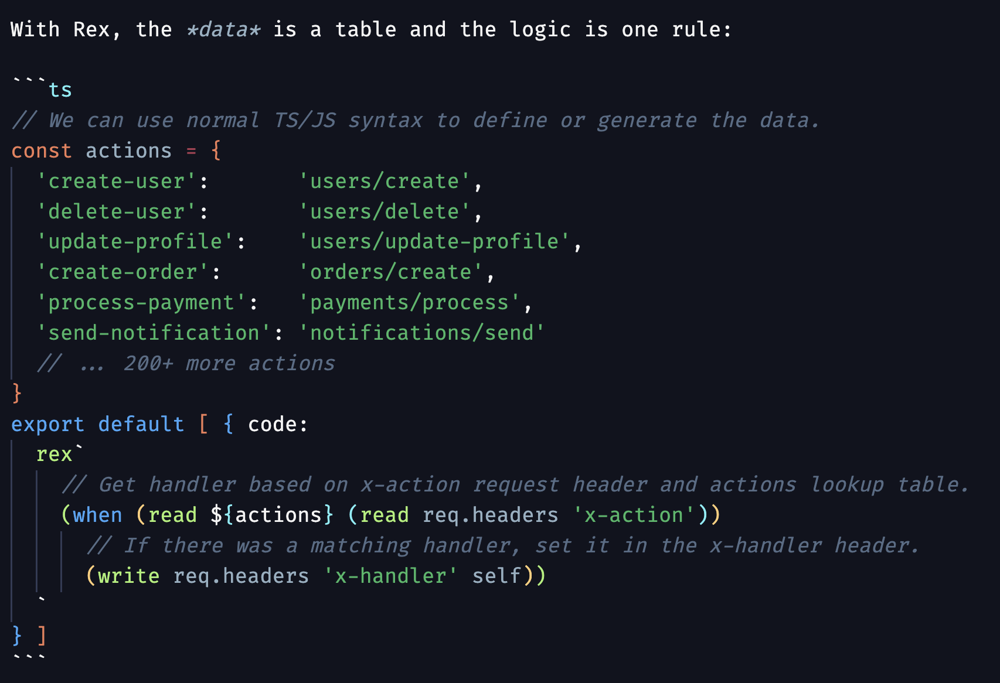

# Rex for Visual Studio Code

Syntax highlighting for [Rex](https://github.com/creationix/rex) — programmable JSON with small arms and a big bite.



## Features

- Syntax highlighting for `.rex` files
- Rex code blocks in Markdown (` ```rex `)
- Rex tagged template literals in TypeScript and JavaScript

## What is Rex?

Rex is a data format that extends JSON with logic. Any valid JSON is already valid Rex — you add `()` where you need computation. Source compiles to compact JSON bytecode that you can store, serialize, and diff like any other data.

```rex
actions = {
  'create-user':       'users/create'
  'delete-user':       'users/delete'
  'update-profile':    'users/update-profile'
}

(when handler=(actions (headers 'x-action'))
  (write headers 'x-handler' handler))
```

Learn more at [github.com/creationix/rex](https://github.com/creationix/rex).
