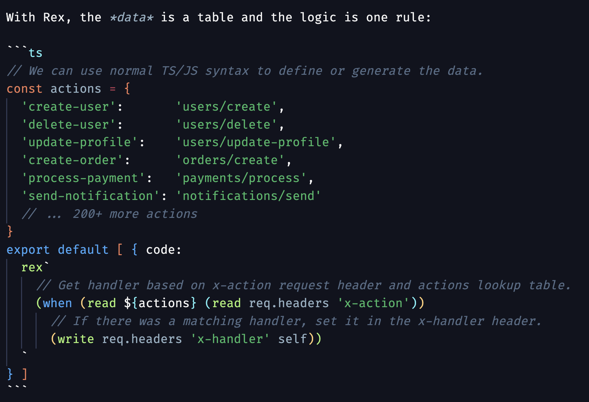

# Rex for Visual Studio Code

Syntax highlighting for [Rex](https://github.com/creationix/rex) — programmable JSON with small arms and a big bite.



## Features

- Syntax highlighting for `.rex` files
- Rex code blocks in Markdown (` ```rex `)
- Rex tagged template literals in TypeScript and JavaScript

## What is Rex?

Rex is a data format that extends JSON with high-level infix logic. Any valid JSON is already valid Rex, and you can add conditionals, assignment, loops, and comprehensions directly in source. Rex compiles to compact `rexc` bytecode that you can store, serialize, and diff like any other data.

```rex
actions = {
  create-user: "users/create"
  delete-user: "users/delete"
  update-profile: "users/update-profile"
}

when handler = actions.(headers.x-action) do
  headers.x-handler = handler
end
```

Learn more at [github.com/creationix/rex](https://github.com/creationix/rex).
